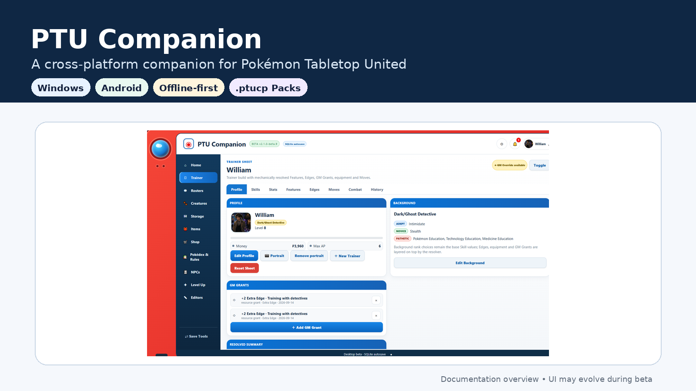
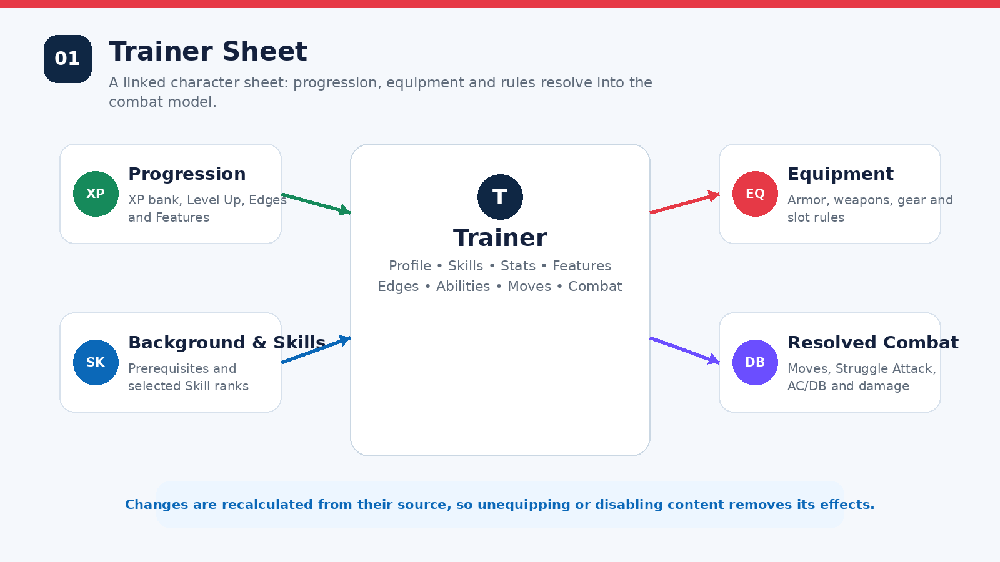
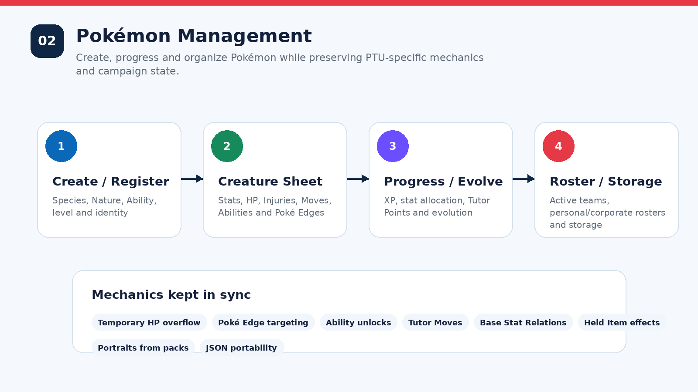
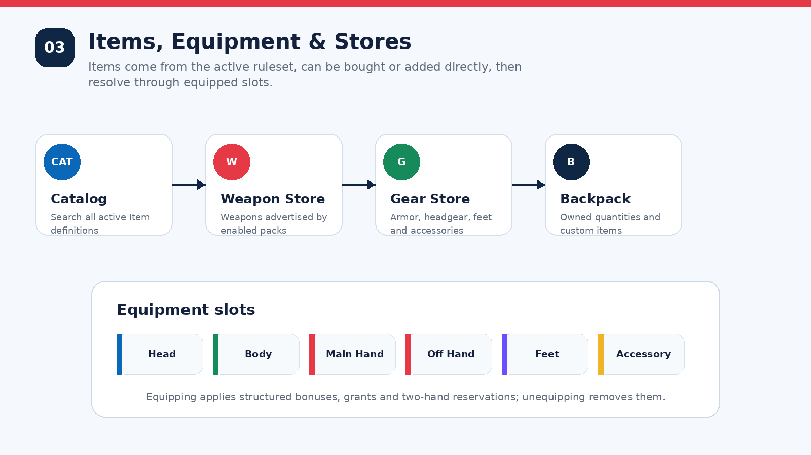
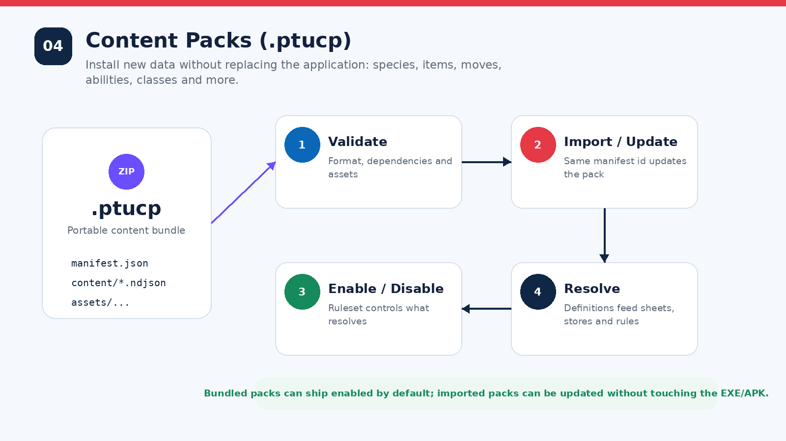
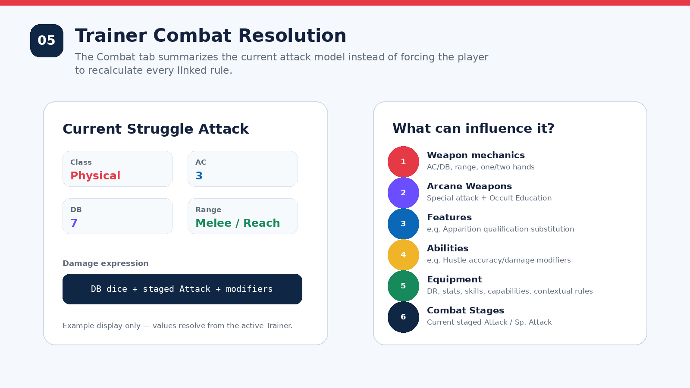
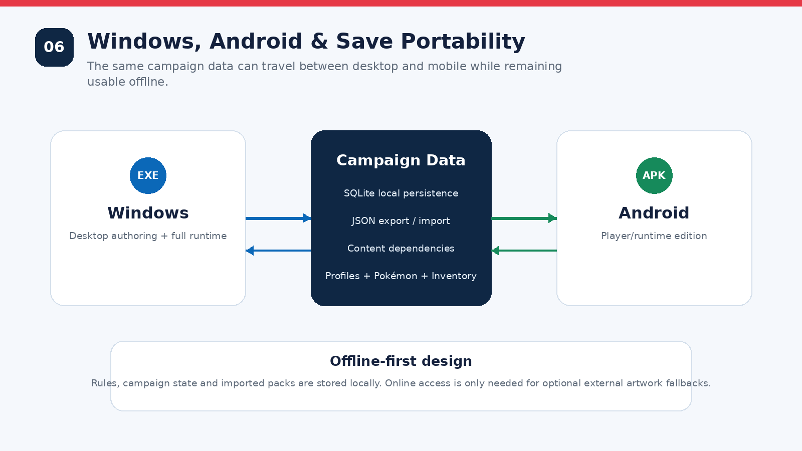
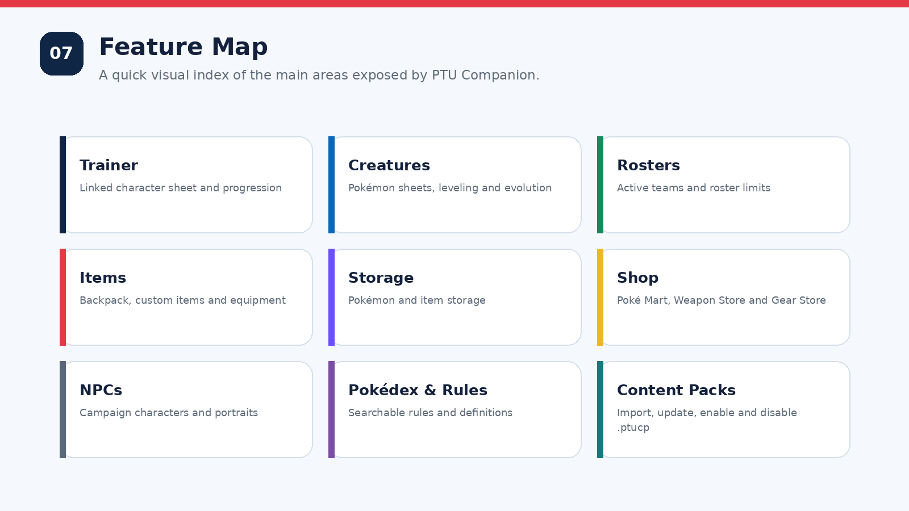

# PTU Companion



**PTU Companion** is a cross-platform companion application for **Pokémon Tabletop United (PTU)** campaigns. It brings Trainer sheets, Pokémon management, rosters, inventory, equipment, stores, rules lookup and data-driven content packs into a single offline-first application for Windows and Android.

> **Project status:** Beta. The rules engine is intentionally conservative: deterministic effects are automated, while target-dependent, triggered, Bound, Scene/Daily and other contextual effects stay visible as contextual rules unless the app has enough state to resolve them safely.

## Highlights

- **Trainer sheet with linked mechanics** — Background, Skills, Stats, Features, Edges, Abilities, Moves, GM Grants and equipment resolve into a single mechanical model.
- **Pokémon management** — create and progress Pokémon, manage HP/Temporary HP, Injuries, Moves, Abilities, Tutor Points, Poké Edges, evolution and Base Stat Relations.
- **Combat support** — calculated Trainer Moves and a resolved **Current Struggle Attack** that reacts to weapons, Arcane Weapons, Skills, Features, Abilities, equipment and Combat Stages.
- **Inventory and equipment** — Backpack, equipment slots, Trainer/Pokémon compatibility, custom items, real item artwork and automatic equip/unequip effects.
- **Stores** — Poké Mart-style shopping plus dedicated **Weapon Store** and **Gear Store** catalogs driven by active content packs.
- **Pokédex & Rules Library** — browse and search the definitions available in the active ruleset.
- **`.ptucp` content packs** — install new data without replacing the application. Packs can add or override species, moves, abilities, capabilities, features, edges, items and other supported datasets.
- **Multiple Trainer profiles, Rosters, Storage and NPCs** — campaign data stays together and can be exported/imported as JSON.
- **Windows + Android** — desktop authoring/full runtime on Windows and a player-focused Android runtime.
- **Offline-first** — campaign state, rules and installed packs are kept locally. External artwork is optional and can be cached or bundled in packs.

## How the application works

### 1. Trainer sheet



Trainer data is not stored as a collection of unrelated text fields. The rules engine continuously resolves the active Background, Skills, Stats, Features, Edges, Abilities, GM Grants and equipped items. Removing the source of an effect removes the effect from the resolved sheet.

### 2. Pokémon management



Pokémon can be created from the active species definitions, assigned to rosters, moved to storage, leveled, evolved and trained. The app tracks PTU-specific progression such as Tutor Points, level-up stat allocation, ability unlocks, Poké Edges, Base Stat Relations and Temporary HP.

### 3. Items, equipment and stores



The **Items** screen uses the active ruleset as its source of truth. `+ Add game item` searches all active item definitions, while stores expose purchasable subsets. Equipment is linked to slots such as Head, Body, Main Hand, Off Hand, Feet and Accessory.

Structured equipment can apply or grant:

- Stats and Skill bonuses;
- Damage Reduction, Evasion, Accuracy and Save modifiers;
- Capabilities, Moves and Abilities;
- weapon AC/DB/range and hand requirements;
- configurable choices such as Skill, Stat, Type or Biome;
- contextual effects that remain visible until the relevant combat state can be resolved.

### 4. Content packs



A `.ptucp` file is a versioned ZIP-based content package. The application validates the manifest, dependencies and supported assets before importing it into the persistent definition database.

Typical workflow:

1. Create or download a compatible `.ptucp`.
2. Import it from **Pokédex & Rules / Content Packs**.
3. Enable or disable it in the active ruleset.
4. Re-import a newer file with the same manifest `id` to update it.
5. Export a campaign normally; content dependencies are recorded so another installation can identify missing packs.

The current application can also ship selected packs **bundled and enabled by default**.

For pack authoring details, see `PTU_CONTENT_PACK_CONVERSION_GUIDE_v2.md`.

### 5. Combat resolution



The Trainer **Combat** tab shows resolved attacks instead of making the player manually combine every rule. The Struggle Attack resolver understands the base PTU attack, weapon AC/DB/range, current Combat Stages, supported Feature substitutions, Arcane Weapon rules and static modifiers such as Ability or equipment bonuses.

The engine deliberately avoids pretending that conditional rules are permanent. Effects that depend on a target, a critical hit, weather, a Scene/Daily use, a Bound Feature, a specific trigger or other missing state are surfaced as contextual rules until they can be resolved correctly.

### 6. Windows, Android and data portability



Campaign state is stored locally. JSON export/import can move a campaign between installations, while `.ptucp` files move reusable rule/content definitions independently of the save.

### 7. Main areas



## Windows

The current desktop beta is distributed as a Windows executable. On first launch the application installs/extracts its runtime under the user's Local AppData directory and keeps persistent campaign data separate from application version files.

The desktop edition contains the complete runtime and the authoring-oriented workflows used to manage campaign content.

## Android

The Android edition is a Tauri 2 player/runtime build. It includes the campaign functionality and content-pack import/management needed during play, while desktop-only authoring tools stay out of the mobile UI.

Canonical ARM64 build command:

```powershell
docker compose run --rm android-arm64-release-apk
```

Expected output for the current documented Android beta:

```text
dist/android/PTU-Companion-v2.2.0-beta.18-arm64-release.apk
```

> Do not publish the private beta signing keystore. A public release should use a separate release key kept outside the repository.

## Development

The desktop source uses Node.js, a local HTTP runtime, React/Vite UI assets, SQLite persistence and a data-driven PTU definition database.

Useful commands:

```powershell
npm run dev
npm run build
npm run functional
npm run verify
```

`npm run verify` runs the project regression suite for the supported rules and content-pack behaviors.

## Release workflow

`main` is the source of truth for published application versions. Release changes should be prepared on a dedicated branch, reviewed through a Pull Request and merged only after version metadata and verification are complete. A release tag then points to the exact merged `main` commit used to build the distributable files.

Generated Windows `.exe` and Android `.apk` files are published as **GitHub Release assets**, together with checksums and non-secret build/signing metadata, rather than being committed to the source tree. Release tags are treated as immutable so every published binary remains traceable and reproducible from a specific source commit.

For the complete versioning, tagging, Android signing and publishing procedure, see [`GITHUB_PUBLISHING_CHECKLIST.md`](GITHUB_PUBLISHING_CHECKLIST.md).

## Content packs included by default

The documented beta bundles and enables the following packs in the `All Supplied Material` ruleset:

- **PTU Weapons — Core, Arcane, Living & Alchemy v2.1.0**
- **PTU Trainer Gear v1.0.0**

Additional `.ptucp` files can be imported without rebuilding the application.

## Repository layout

```text
.
├─ src/                     # React/Vite desktop UI source
├─ static-preview/          # functional desktop runtime UI
├─ rules/                   # Trainer/Pokémon/rules resolution
├─ definitions/             # definition repository + pack importer/manager
├─ persistence/             # SQLite campaign persistence
├─ seed/                    # default state, definition DB and bundled packs
├─ scripts/                 # verification/build helpers
├─ desktop/                 # Windows launcher/runtime packaging
└─ docs/
   └─ images/               # GitHub documentation images
```

## Seed database

`seed/ptu_seed_v1.0.sqlite3` is intentionally published in this repository as the default definition database.

- It contains only public, static data: rules, Pokémon, items, content-pack metadata and references to image assets.
- It must never store personal data, credentials, tokens, keys, local file paths, user or campaign data, or binary images. Images stay as separate versioned assets (for example `PTU_Companion_Android_Tauri/www/pokemon-sprites/`) and the database only references them by id.
- Any future change to its schema or content must preserve this policy.

## Content-pack philosophy

PTU Companion favors **source-aware automation**. A bonus or granted Move/Ability should know where it came from. This allows the app to remove the effect when the source is unequipped, disabled or no longer applicable, and helps avoid permanent bonuses being accidentally applied from conditional rules.

## Fan project notice

This repository is a non-commercial fan-made companion for Pokémon Tabletop United. Pokémon and related trademarks are the property of their respective owners. Pokémon Tabletop United is a fan-made tabletop system; this project is not affiliated with or endorsed by Nintendo, Creatures Inc., GAME FREAK, The Pokémon Company or the PTU authors.

Do not commit copyrighted sourcebooks, private signing keys, personal campaign saves or other files you do not have permission to redistribute.

## Screenshots and documentation

The diagrams in `docs/images/` explain application behavior and may be updated as the beta UI evolves. `00-overview.png` is based on the current desktop interface; the remaining images are explanatory documentation diagrams rather than pixel-perfect screenshots of every screen.